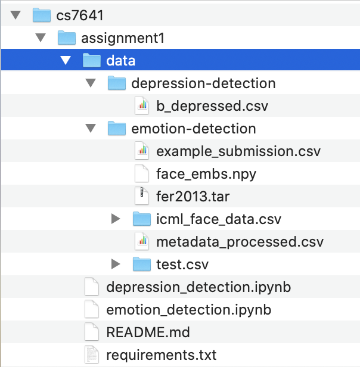

# Detecting Depression and Emotions Using Machine Learning

## GitHub Link
https://github.com/yujing1004/cs7641/tree/master/assignment1

## System requirements

1. Python 3 (The version I worked with is 3.8.5)
2. Install required libs: `pip install -r requirements.txt`

## How to reproduce results

### Download data

1. Download [data set for Depression Detection](https://www.kaggle.com/diegobabativa/depression) to under the folder `cs7641/assignment1/data/depression-detection/`
2. Download [data set for Emotion Detection](https://www.kaggle.com/debanga/facial-expression-recognition-challenge) to under the folder `cs7641/assignment1/data/emotion-detection/`, and unzip after downloading

The final layout should look like this:

### Run the notebook

1. Under the folder `assignment1`, start a notebook server by running: `jupyter notebook`, which will direct you to the notebook UI with your default browser
2. On notebook UI, click `depression_detection.ipynb` or `emotion_detection.ipynb` for the corresponding problem
3. For either noteook, there is a section named `Train, select and fine-tune a model`; in the first cell of that section, configure:
   * `model_hyper_parameters`: modify only necessary, leave it as it as if simply trying to reproduce result
   * `model_name`: to be one of them enabled as indicated in `model_hyper_parameters`
4. Use notebook menu to run the entire notebook: `Cell -> Rull All`
