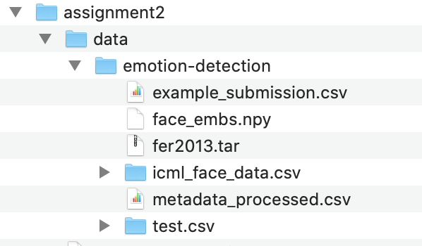

# Randomized Optimization

## GitHub Link
https://github.com/yujing1004/cs7641/tree/master/assignment2

## System requirements

1. Python 3 (The version I worked with is 3.8.5)
2. Install required libs: `pip install -r requirements.txt`

## How to reproduce results

### How to run a notebook in general

1. Under the folder `assignment2`, start a notebook server by running: `jupyter notebook`, which will direct you to the notebook UI with your default browser
2. On notebook UI, click the notebook you would like to run
3. Use notebook menu to run the entire notebook: `Cell -> Rull All`

### Four algorithms on three problems

1. Run notebook `randomized_optimization.ipynb`, which will show all the results, and that is it!
2. Optionally, run notebook `knapsack_solver.ipynb` to confirm the globally optimal solution to the 0-1 knapsack problem, whhich sets the ultimate goal (as an upper bound as well) for random optimization algorithms

### Neural network weight optimization

1. Download [data set for Emotion Detection](https://www.kaggle.com/debanga/facial-expression-recognition-challenge) to under the folder `cs7641/assignment2/data/emotion-detection/`, and unzip after downloading. The final layout should look like this:

2. Click to open notebook `neural_network_weight_optimization_emotion_detection.ipynb`
3. Set the algorithm to use in the first cell under section `Optimize Neural Network weights by randomized optimization`
   * Specifically, this line of code: `algorithm = 'genetic_alg'  # CHNAGE ALGORITHM HERE`
4. Run the notebook `neural_network_weight_optimization_emotion_detection.ipynb`
   * WARNING: `genetic_alg` takes hours to complete
