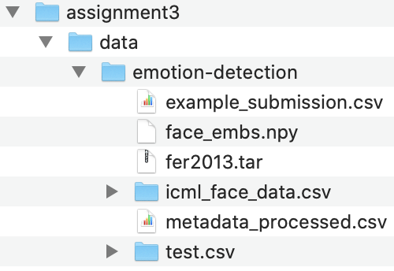

# Unsupervised Learning

## GitHub Link
https://github.com/yujing1004/cs7641/tree/master/assignment3

## Code Link
1. SCADI: https://github.com/yujing1004/cs7641/blob/master/assignment3/unsupervised_learning_scadi.ipynb
2. Emotion Detection: https://github.com/yujing1004/cs7641/blob/master/assignment3/unsupervised_learning_emotion_detection.ipynb

## System requirements

1. Python 3 (The version I worked with is 3.8.5)
2. Install required libs: `pip install -r requirements.txt`

## How to reproduce results

### How to run a notebook in general

1. Under the folder `assignment3`, start a notebook server by running: `jupyter notebook`, which will direct you to the notebook UI with your default browser
2. On notebook UI, click the notebook you would like to run
3. Use notebook menu to run the entire notebook: `Cell -> Rull All`, or run cell by cell

### Prepare emotion detection data

1. Download [data set for Emotion Detection](https://www.kaggle.com/debanga/facial-expression-recognition-challenge) to under the folder `cs7641/assignment3/data/emotion-detection/`, and unzip after downloading. The final layout should look like this:

### Run notebooks to reproduce results

1. Run `unsupervised_learning_scadi.ipynb` to reproduce results for SCADI dataset
2. Run `unsupervised_learning_emotion_detection.ipynb` to reproduce results for emotion detection dataset

Note: The settings (algorithm and parameters) for each experiment are typically located in the first cell of each section (Part I-V) in the notebook
